# Gixo's Hyprland Rice on Arch Linux

Here are my configuration files for this rice. This rice relies heavily on [Pywal](https://github.com/dylanaraps/pywal). Colors change as you change your wallpaper!

These dot files are provided are meant for **Nvidia GPUs** with no guarantee, use them at your own risk.

**There's a delayed unmount and poweroff script included in shutdown script meant for USB hard drives. You might want to delete it by removing `~/.config/rofi/scripts/usb-sleep` in line 60 of `powermenu` file under rofi scripts directory.**

## Credits

A huge portion of these dot files are based on [rchrdwllm's](https://github.com/rchrdwllm/dotfiles) amazing work.

## Features

- Dynamic colors from wallpapers
- Firefox and VS Code are themed according to those dynamic colors
- Black GTK and Kvantum themes
- Customized shortcuts
  - Launch apps `Super + D`
  - Emojis `Super + ,`
  - Blank screen `Super + B`
  - Lock screen `Super + L`
  - Toggle floating mode `Super + Space`
  - Toggle grouping `Super + G`
  - Toggle waybar `Super + T`
  - Launch Firefox `Super + W`
  - Open VS Code `Super + C`
  - Resize windows `Super + RMB`
  - And a lot more can be found in `~/.config/hyprland/hyprland.conf`
- Waybar with custom widgets

## Apps

**Terminal:** Kitty

**Shell:** Zsh

**Browser:** Firefox

**File manager:** Dolphin

**Login manager:** ly

**Themes:** Modified Kvantum Carl theme for Qt and Arc-BLACKEST for GTK

**Icons theme:** Papirus Dark

## Screenshots

### Wallpaper Test 1

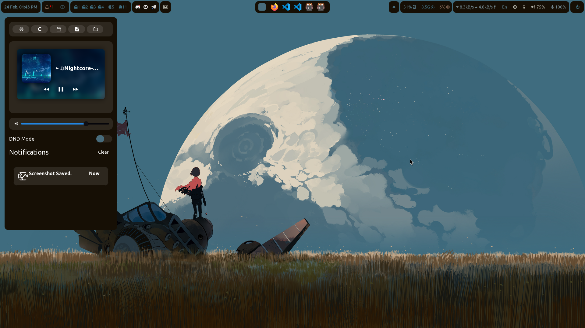
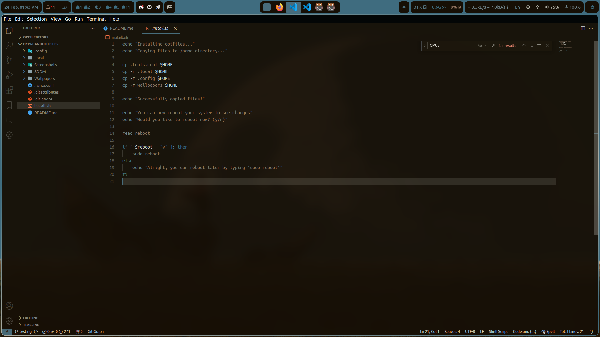
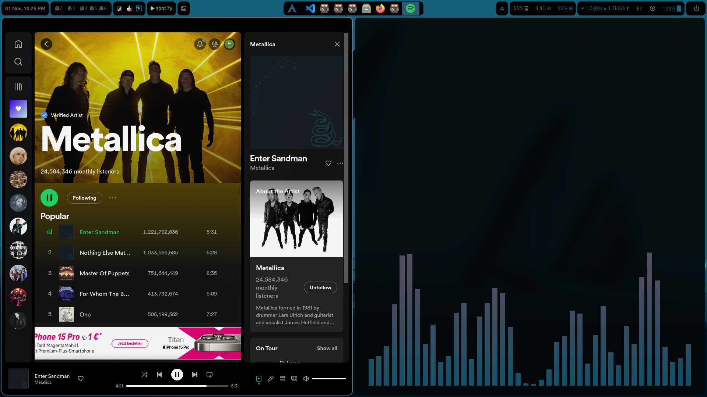
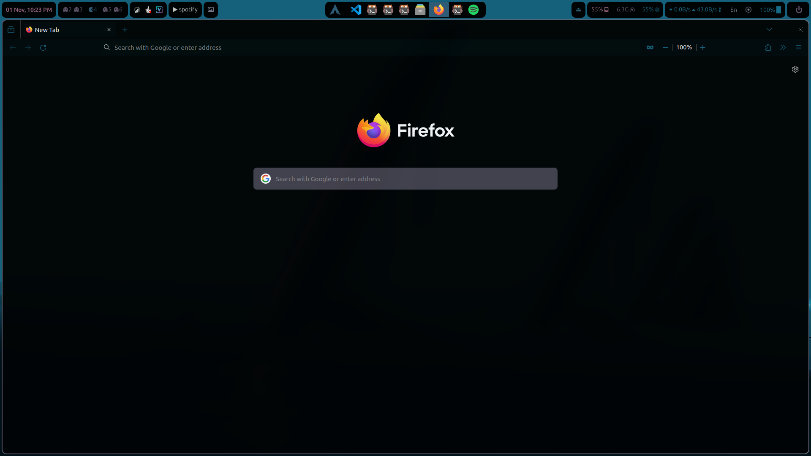
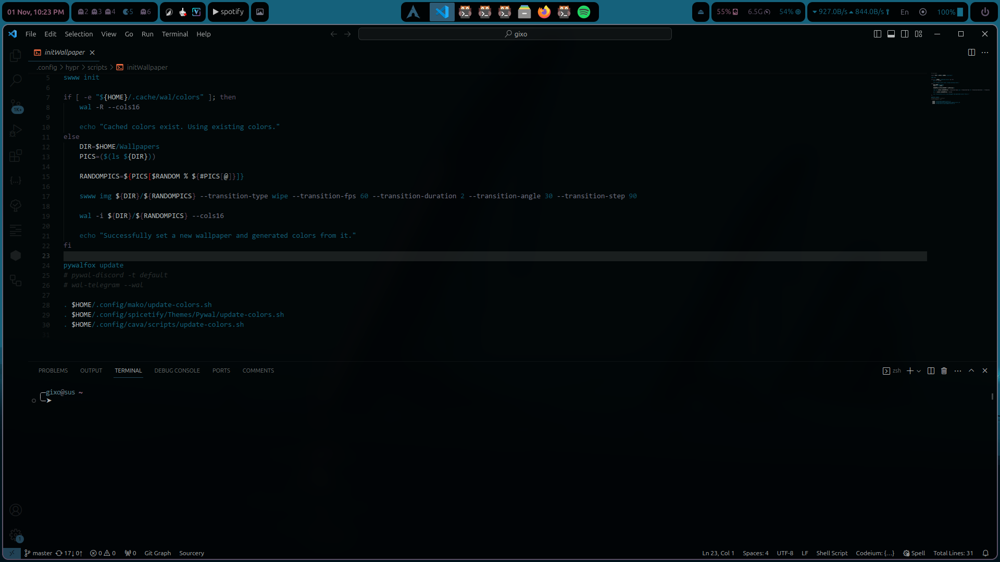

### Wallpaper Test 2

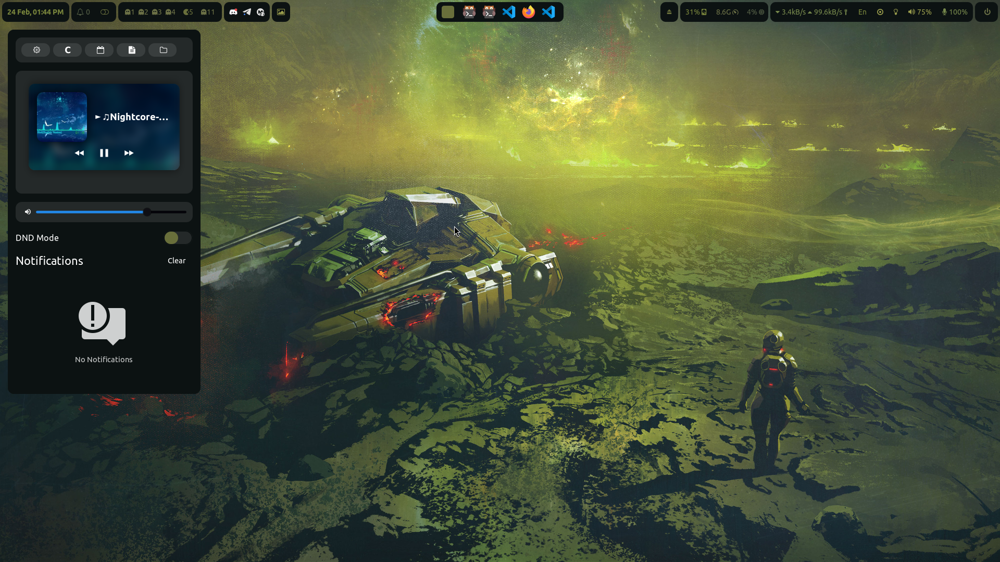
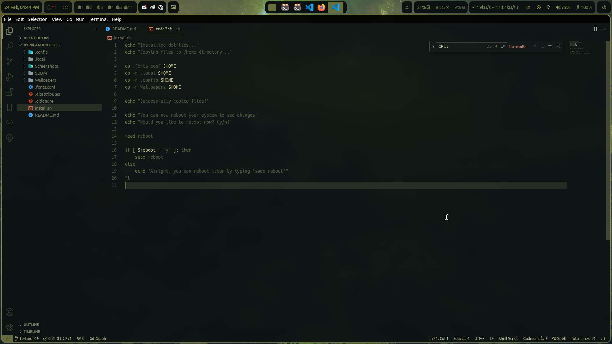
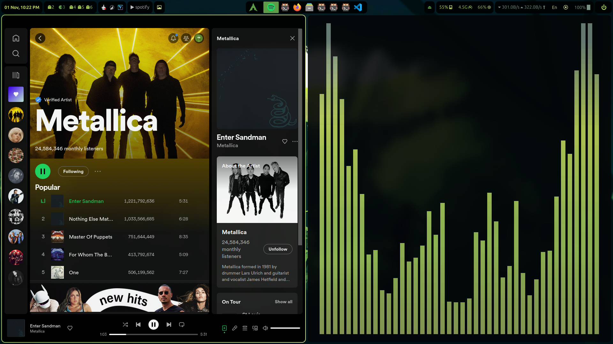
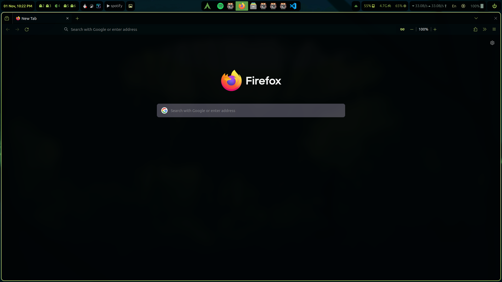
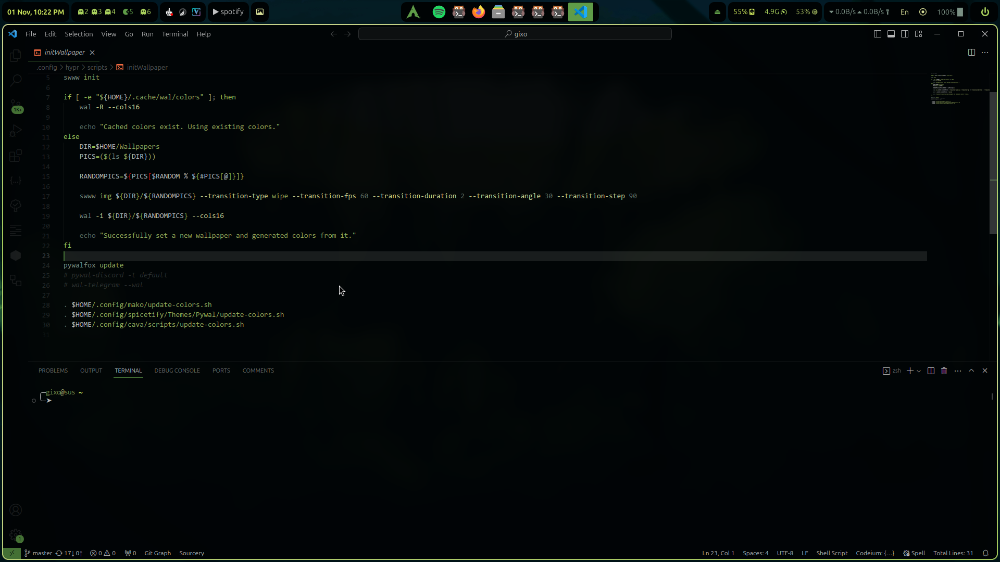

### Wallpaper Test 3

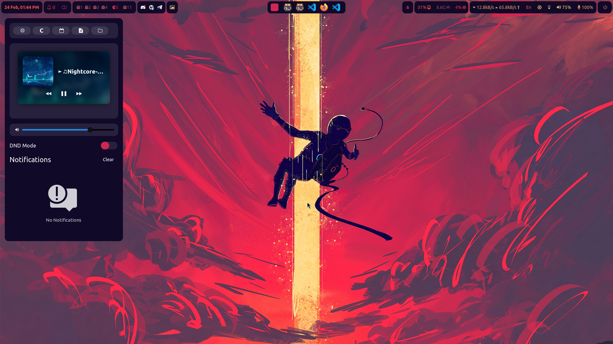
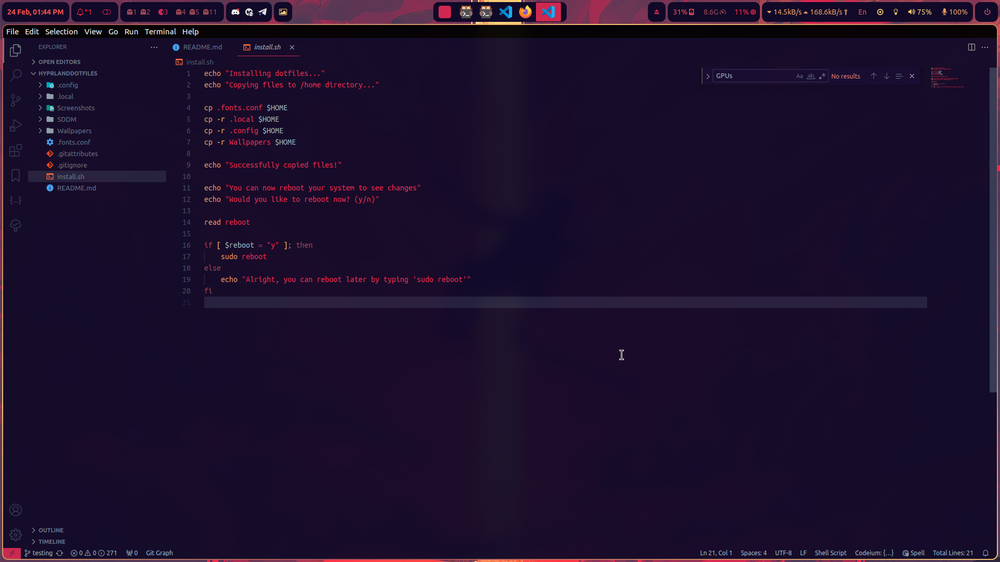
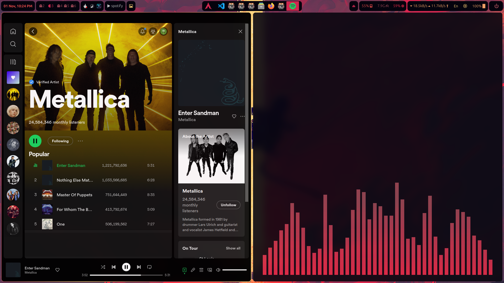
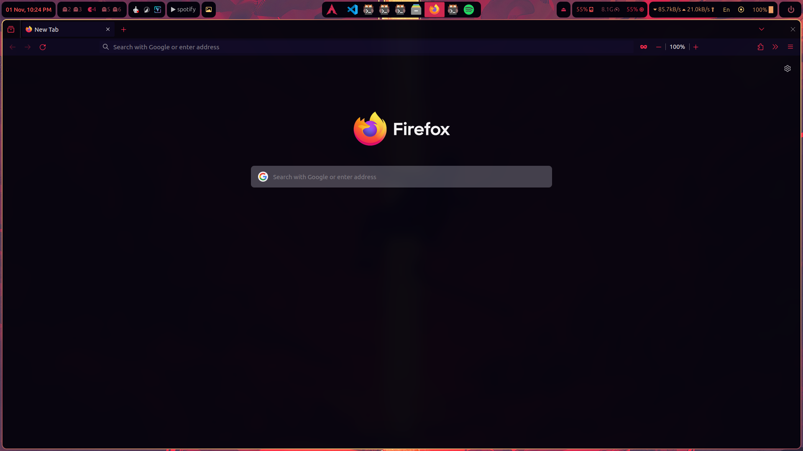
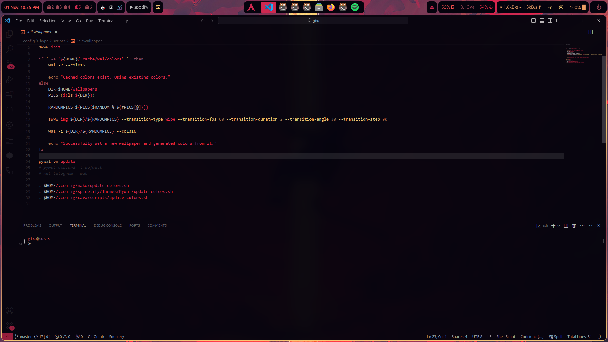

# Installation

If you have trouble installing Hyprland for Nvidia GPUs, you should try using [JaKooLit's script](https://github.com/JaKooLit/Hyprland-v4).

Before using dot files, make sure to at least have the necessary packages installed.

### Necessary packages

**Base packages:**

```
sudo paru -S --needed hyprland-nvidia-git wayland xorg-xwayland qt5-wayland qt6-wayland grim gvfs gvfs-mtp jq pamixer xfce-polkit pavucontrol pipewire-alsa playerctl slurp swappy swayidle sway-audio-idle-inhibit-git swaylock-effects waybar wget wl-clipboard cliphist rofi rofi-emoji xdg-user-dirs libdrm pixman libxkbcommon python python-requests python-pillow python-pywalfox libxml2 llvm libpng gegl mtdev swww wlroots inetutils clinfo update-grub xorg-xhost lshw btop wlsunset speech-dispatcher python-pip inotify-tools mako-git gnome-keyring imagemagick wtype alsa-firmware tumbler dunst xdg-desktop-portal xdg-desktop-portal-gtk ly
```

**Terminal, browser and file manager:**

```
sudo paru -S kitty firefox dolphin dolphin-plugins
```

Laptop brightness control:**

```
sudo paru -S brightnessctl
```

**Desktop monitor brightness control:**

```
sudo paru -S ddcutil
```

**Bluetooth:**

```
sudo paru -S blueberry bluez bluez-utils
```

**Theming:**

```
sudo paru -S papirus-icon-theme papirus-folders nwg-look-bin kvantum qt5ct
```

**Fonts:**

```
sudo paru -S ttf-ubuntu-font-family noto-fonts-emoji ttf-fira-code otf-font-awesome otf-font-awesome-4 ttf-droid ttf-fantasque-sans-mono ttf-jetbrains-mono ttf-jetbrains-mono-nerd inter-font-beta adobe-source-code-pro-fonts vazirmatn-fonts
```

### Extra packages

Here are a collection of useful extra packages you might want to install:

**Package management:**

```
sudo paru -S flatpak bauh
```

**Utilities:**

```
sudo paru -S file-roller gparted tmux simple-scan qdirstat nvtop
```

**Internet and networking:**

```
sudo paru -S brave-bin google-chrome chromium telegram-desktop gufw filezilla
```

**Spell check:**

```
sudo paru -S enchant ispell hunspell hunspell-en_us
```

**Codecs:**

```
sudo paru -S ffmpeg ffmpegthumbs jasper lame libdca libdv gst-libav libtheora libvorbis libxv wavpack x264 x265 dav1d rav1e xvidcore dvd+rw-tools dvdauthor dvgrab libmad libmpeg2 libdvdcss libdvdread libdvdnav exfat-utils fuse-exfat a52dec faac faad2 flac
```

**File systems:**

```
sudo paru -S ntfs-3g ntfsprogs udf udftools dosfstools exfatprogs f2fs-tools hfsprogs reiser4progs
```

**Media:**

```
sudo paru -S vlc mpv smplayer smplayer-themes ristretto spotify spicetify-cli
```

**Productivity:**

```
sudo paru -S libreoffice audacity gimp krita inkscape blender
```

**Development:**

```
sudo paru -S neovim dotnet-sdk visual-studio-code-bin github-cli repo
```

**OBS:**

```
sudo paru -S obs-studio wlrobs wlrobs-hg gstreamer-vaapi obs-vaapi
```

**Gaming:**

```
sudo paru -S steam heroic-games-launcher-bin lutris mangohud goverlay-bin
```

Lutris dependencies:

```
sudo pacman -S --needed wine-staging giflib lib32-giflib libpng lib32-libpng libldap lib32-libldap gnutls lib32-gnutls mpg123 lib32-mpg123 openal lib32-openal v4l-utils lib32-v4l-utils libpulse lib32-libpulse libgpg-error lib32-libgpg-error alsa-plugins lib32-alsa-plugins alsa-lib lib32-alsa-lib libjpeg-turbo lib32-libjpeg-turbo sqlite lib32-sqlite libxcomposite lib32-libxcomposite libxinerama lib32-libgcrypt libgcrypt lib32-libxinerama ncurses lib32-ncurses ocl-icd lib32-ocl-icd libxslt lib32-libxslt libva lib32-libva gtk3 lib32-gtk3 gst-plugins-base-libs lib32-gst-plugins-base-libs vulkan-icd-loader lib32-vulkan-icd-loader
```

Lutris Nvidia drivers:

```
sudo pacman -S --needed nvidia-dkms nvidia-utils lib32-nvidia-utils nvidia-settings vulkan-icd-loader lib32-vulkan-icd-loader
```

**TUI:**

```
sudo paru -S ranger mc cava cmatrix tty-clock pipes.sh screenfetch tetris-terminal-git fzf ytfzf
```

**Flatpak packages:**

```
flatpak install flathub net.nokyan.Resources com.github.tchx84.Flatseal io.github.shiftey.Desktop md.obsidian.Obsidian com.discordapp.Discord
```

**Some electron apps work better installed using Flatpak and modified using Flatseal, instead of using electron flags.**

## Setting up Oh My Zsh and Powerlevel10k Theme

I personally used [JaKooLit's script](https://github.com/JaKooLit/Hyprland-v4) to install Oh My Zsh with `gnzh` theme. But you can use [rchrdwllm's instructions](https://github.com/rchrdwllm/dotfiles) to install it.

## Installing Pywal

If you want the regular Pywal, you can install it with `paru -S python-pywal`. But if you want 16 colors to be generated (which I use in this), you can install it by:

- Cloning [this](https://github.com/eylles/pywal16) repo
- `cd` into the repo and run `pip3 install --user . --break-system-packages`

## Copying the dotfiles

Once done, you can run the `install.sh` script found in this dotfiles directory and do a reboot after. Then, proceed to the next section.

Once done, you can go ahead and copy the files to their respective directories and do a reboot. Be sure to check out the [some notes](#some-notes) section in this README.

## Setting up VS Code

There's a [Pywal](https://marketplace.visualstudio.com/items?itemName=dlasagno.wal-theme) theme for VS Code. Colors will automatically update as well once you apply the theme.

## Setting up Firefox

If you use Firefox and want to have Pywal colors:

- Download the theme extension [here.](https://addons.mozilla.org/en-US/firefox/addon/pywalfox/)
- Run `pywalfox update` in your terminal.

Once done, you don't need to worry about manually updating the colors everytime you change your wallpaper. A script already takes care of that BUT you might need to manually restart Firefox to apply the new colors.

## Setting up Spotify

- Open and login with Spotify first.
- Run these in your terminal:

    ```
    sudo chmod a+wr /opt/spotify
    sudo chmod a+wr /opt/spotify/Apps -R
    ```

- Once done, initially run `spicetify backup apply` in your terminal.
- Then you can set the theme by running `spicetify config current_theme Pywal` in your terminal to set the color theme.

Open Spotify and you should be good to go.

Note that you need to restart Spotify every time the colors are changed.

## Qt theming

Add the line below to the /etc/environments:

```
QT_QPA_PLATFORMTHEME=qt5ct
```

Please note that using the line above in my Hyprland config, caused some Qt apps to crash.

Also using the lines below in my environments file caused some Qt apps to crash as well.

With that said, your mileage may vary, so experiment with different environment options.

```
QT_QPA_PLATFORM="xcb;wayland"
GDK_BACKEND=wayland
```

## Some notes <a name="some-notes"></a>

- I don't know about you but in case you're experiencing a super slow reboot or shutdown with this, I followed [this](https://www.reddit.com/r/archlinux/comments/whsqdq/comment/ij9r90h/?utm_source=reddit&utm_medium=web2x&context=3) Reddit comment and it helped! Not really sure why that's happening, though.
- If you get an error on line 60 of `hyprland.conf` after rebooting saying that colors couldn't be found, be sure to check line 24. Replace "uiriamu" with your Linux username. After that, run `hyprctl reload` in your terminal. Once this is resolved, it shouldn't happen anymore for future reboots.
- This repo is also open to forks if you guys want to make changes of your own and take them into your own repository.

## Fixing miscellaneous problems

### Ly is not enabled

If you've already installed another login manager first run before enabling Ly:

```
sudo systemctl disable <the name of the login manager>
```

Use this line to enable Ly:

```
sudo systemctl enable ly
```

### Dolphin's default terminal

```
nano ~/.config/kdeglobals
```

Add this at the end of the file:

```
[General]
TerminalApplication=gnome-terminal
```

### Fix Obsidian lagging

Install it through flathub and then use Flatseal to turn off **gpu acceleration** for it.

### VS Code lagging / not launching

I've already added needed flags for VS Code to `~/.config/code-flags.conf file`.

All you have to do is to add this line to your VS Code's user settings JSON file.

```
"window.titleBarStyle": "custom",
```

### Setting default applications

```
xdg-settings set default-web-browser firefox.desktop
xdg-mime default dolphin.desktop inode/directory
xdg-mime default kitty.desktop application/x-shellscript
```

### Setting up ddcutil

Just run the commands below to use **ddcutil** without root permission:

```
sudo modprobe i2c-dev
ddcutil capabilities | grep "Feature: 10"
sudo cp /usr/share/ddcutil/data/45-ddcutil-i2c.rules /etc/udev/rules.d
sudo groupadd --system i2c
sudo usermod $USER -aG i2c
sudo touch /etc/modules-load.d/i2c.conf
sudo sh -c 'echo "i2c-dev" >> /etc/modules-load.d/i2c.conf'
sudo reboot
```
